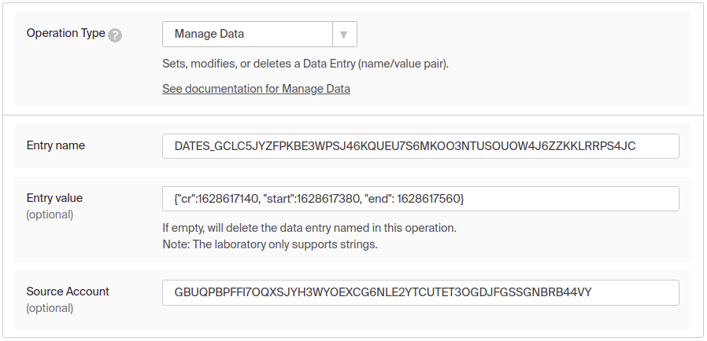

#   Technical documentation  for voting 

The voting system is implemented in several parts. The first part is a server that creates and counts votes, and the second part is handlers with which you can get various information about the vote.

The voting server is located at `horizon/internal/voting/voting.go`, it starts after a certain time and calls the following 4 methods.

1.  #### CalculateWarmVotings 
This method calculates the voting results from the System.warm and writes them to the database. To obtain the voting result, the CalculateWarmVotings method does the following: 1. creates a trustline snapshot for the asset 2. collects all votes and calculates the balance of those who voted and the total number of assets. 3. records the result of voting in the database;
2. #### tickMonitoring
This method analyzes all of the issuer accounts that have created admin accounts for voting through transactions.
3. #### tickRecovery
This method retrieves from the database all votes that have run out of voting time and sends the votes to the CalculateWarmVotings method.   
4. #### tickListWarm
This method retrieves from the database all votes for which voting time expires in a minute and adds them to System.warm.

###PostgreSQL for voting 
There are 3 voting tables in the database. 
1) vote_descriptors this table contains all voting information 
2) vote_options this table contains all voting responses 
3) trustlines_snapsots this table contains a snapshot of trust for a specific asset_code and asset_issuer.
###Voting structure
````
├── horizon
├── internal
│   ├── db2
│   │   ├── main.go
│   │   ├── page_query.go
│   │   ├── page_query_test.go
│   │   ├── schema
│   │   │   ├── bindata.go
│   │   │   ├── main.go
│   │   │   ├── main_test.go
│   │   │   └── migrations
│   │   │       ├── 46_voting_descriptors.sql
│   │   │       ├── 47_voting_options.sql
│   │   │       ├── 48_add_voting_data.sql
│   │   │       └── 49_trustline_snapshots.sql
│   │   └── voting
│   │       ├── descriptor.go
│   │       ├── main.go
│   │       ├── trustlines_snapshot.go
│   │       └── voting_option.go
│   ├── httpx
│   │   ├── handler.go
│   │   ├── middleware.go
│   │   ├── middleware_test.go
│   │   ├── rate_limiter.go
│   │   ├── router.go
│   │   ├── server.go
│   │   └── stream_handler_test.go
│   └── voting
│       ├── action_list_warm.go
│       ├── action_monitoring.go
│       ├── action_recovery.go
│       ├── action_tikc_warm.go
│       ├── calculation.go
│       ├── structures.go
│       └── voting.go
├── main.go
└── README.md

````

##           create a vote

1. You need someone to sign a trust on your asset for your account to become issuer accounts.

2. Your issuer account should now create an admin account.
   
3. Now the administrator account must create a new account and perform the following transactions with it to create a vote.
    - create new account.
      
     - we execute the transaction of creating a vote for the Asset.
       
    - we execute a transaction in which we pass the time of creation, start, end of voting. int64 time format 
      
    - we execute the payment transaction and in the memo (28 byte) field we indicate the names of the vote, question, answers. Q0Q - queue order indicator
      
      
      
      
      
4. To vote, you need to make a payment transaction and indicate the response number in the memo, as shown below. Be sure to include "V" before the answer number, and then write "I".
   
   